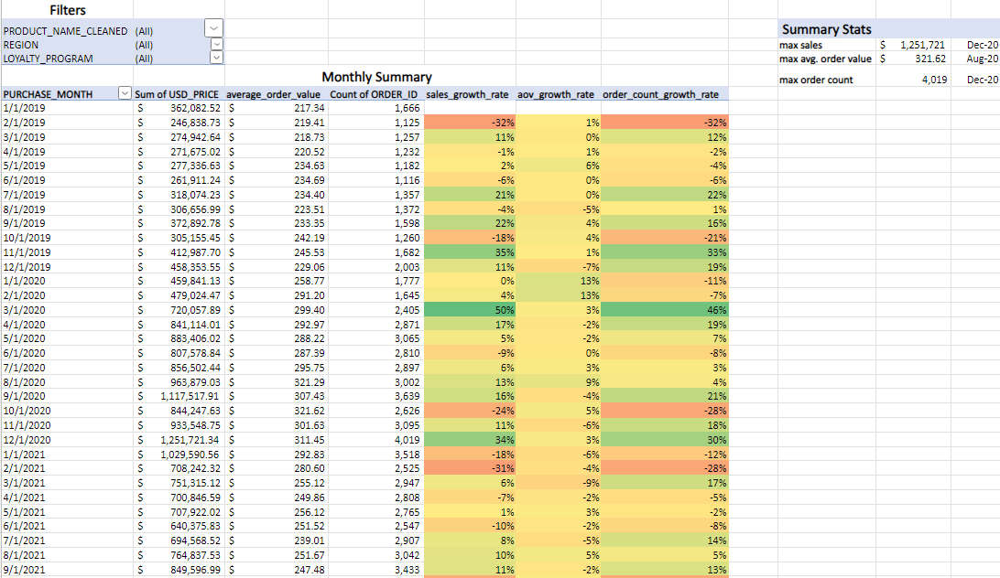
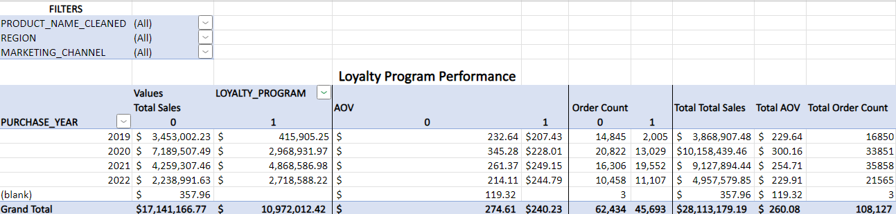
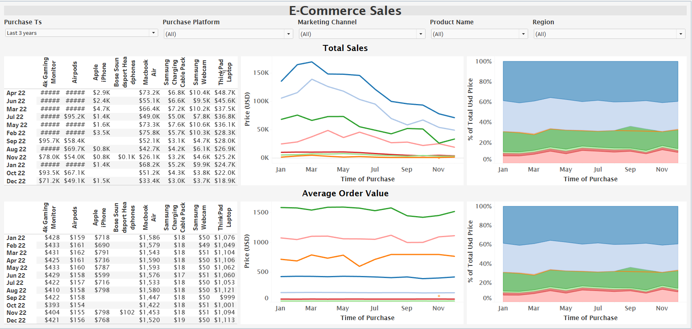
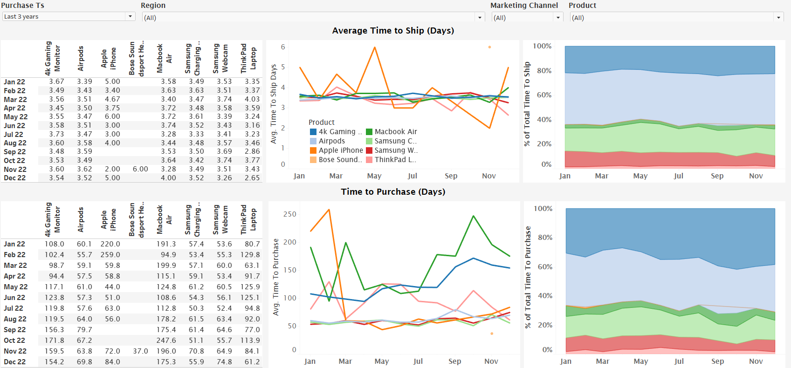

# E-Commerce Sales Analysis
In this project, I analyzed a dataset containing the sales of electronic products to global customers using Excel, Tableau, and SQL. I provide insights and recommendations based on my observations of looking at sales trends from different angles (marketing, regional performance, etc.)

The Excel workbook containing both the raw and cleaned data as well as more detailed analysis can be found [here](orders_analysis.xlsx). The SQL queries can be found [here](sales_analysis.sql). The Tableau workbook can be found [here](elist_sales_analysis.twbx).

### Overall Trends

From 2019 through 2022, the **average yearly sale revenue was $9.3M across 36K sales per year** with an **average order value of $227**. 2020 had the highest average order value at $300, while 2021 had the most sales at 35K. 2020 had the highest growth rate with the average order value increasing by 31%. While there was a slight increase in the number of orders in 2021, the value of the average order decreased by 15%. Each October there is a drop in sales followed by increases in both November and December. This is likely due to holiday sales. In March of 2020, the number of orders increased by 46%, but the average order value only increased by 3%. This increase in purchases could be pandemic related. Throughout all four years, the **Apple Airpods Headphones were the best-selling item accounting for 42-48% of the total sales each year.**

### Marketing
Across all regions, **the marketing channel leading to the most sales is direct (79%) followed by email (17%).** While marketing through affiliates does not produce many sales, it has the highest AOV in North America with $321. 

### Products
**Apple Airpod headphones have been the best selling product with over 40% of the sales each year.** The Bose Soundsport headphones and the Apple iPhone have been the worst selling products, as they account for less than 1% of the sales each year.

### Loyalty Program

Loyalty program members made fewer and less expensive purchases in 2019 and 2020 than non-members. Sales from **loyalty program members surpassed that of non-members in 2021 and 2022.** In the average order value of a loyalty program member was $30 more than non-members in 2022.

### Recommendations

The increase in sales by loyalty program members over recent years suggests that the **loyalty program should be continued.**

Only 1% of sales come from social media and 3% come from affiliates. Consider **decreasing focus on social media and affiliates while increasing efforts towards the direct and email marketing channels.**

## Further Analysis
To increase the sales through the email marketing channel we should examine which promotions are being pushed through these emails and determine which are the most successful in generating sales.

Further analysis could also look into the demographics of the customer base to see which groups of people are buying what.